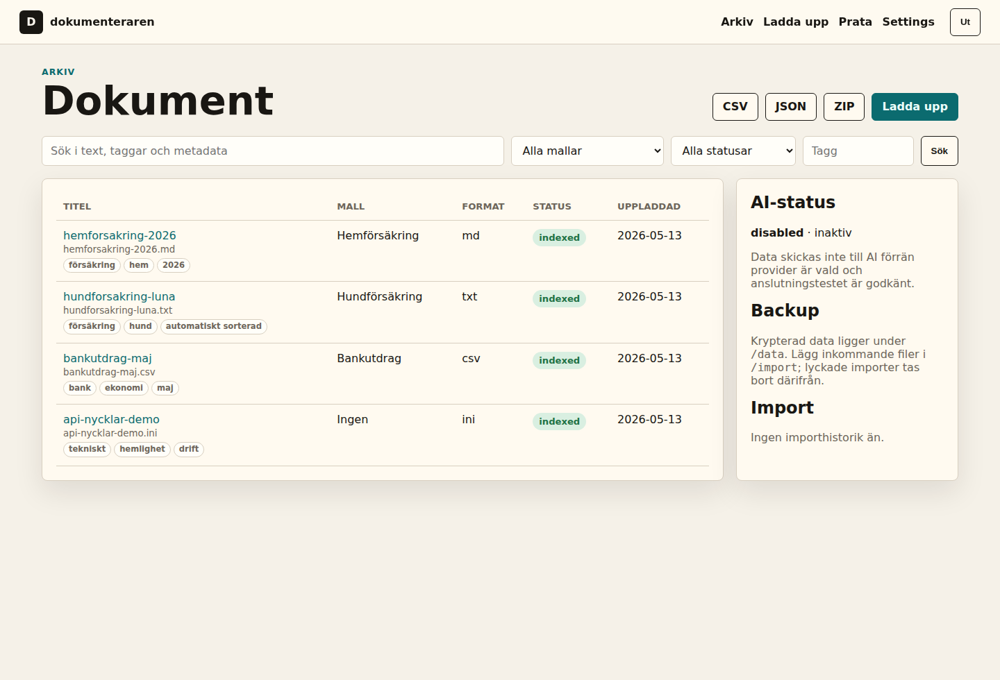
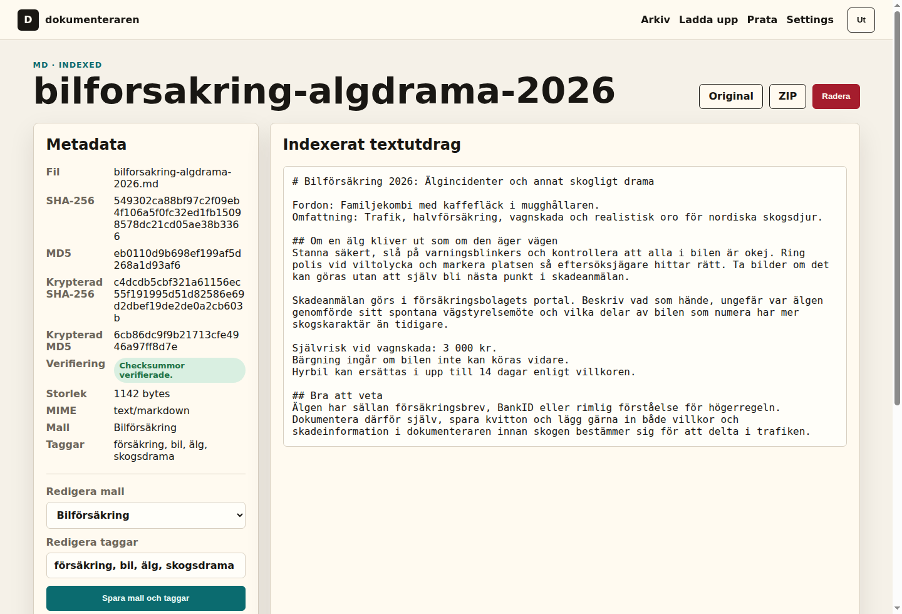

# dokumenteraren

`dokumenteraren` är en lightweight svensk Papra/paperless-inspirerad dokumentapp för människor som vill äga sina viktiga dokument själva, utan att göra molnlagring till standardsvaret på alla livets PDF:er.

Den är byggd för hushåll, self-hosters och IT-personer som vill samla försäkringar, kvitton, bankpapper, avtal, mailbilagor och tekniska hemligheter i ett litet lokalt arkiv där dokumenten faktiskt går att hitta igen.

## Varför?

Det finns redan riktigt bra dokumentarkiv.

- [paperless-ngx](https://docs.paperless-ngx.com/) är stort, moget och kraftfullt.
- [Papra](https://papra.app/en/) är modernare, snyggare och mer strömlinjeformat.

Och så finns den vanliga lösningen: släng allt i OneDrive, Google Drive, Dropbox eller valfri synkmapp och hoppas att filnamnet `scan_2024_final_final2.pdf` betyder något om tre år.

`dokumenteraren` tar en annan position: mindre, svenskare, mer personlig, mer driftbar hemma och mer tydligt byggd för känsliga vardagsdokument. Allt hamnar på ett ställe, krypterat i vila, med dina nycklar på din maskin. Trafiken skyddar du med HTTPS i din egen drift, och dokumenten behöver inte automatiskt bo hos någon amerikansk hyperscaler på andra sidan Atlanten.

Poängen är inte bara att lagra filer. Poängen är att förstå dem. När dokumenten indexeras kan du söka tvärs över försäkringsbrev, avtal, kvitton och tekniska anteckningar. Om du väljer att aktivera AI kan du dessutom prata med valda dokument:

> "Vad händer om jag kör på en älg?"

Har du lagt in bilförsäkring, villkor och skadeinformation kan appen hjälpa dig hitta relevanta delar i just dina dokument. Inte som juridisk rådgivning, men som ett snabbare sätt att hitta rätt i högen när du faktiskt behöver svaret.

Tanken är inte att vinna på flest features, utan på att vara lätt att förstå, lätt att backa upp och trygg att köra själv.

## Vad Den Gör

- Dokumentarkiv med upload, sök, taggar, mallar och permanent radering.
- Mallar för försäkringar, bank, kredit, juridik, kvitton, teknik och lösenordsrelaterade dokument.
- Import via webb, importmapp, API, CLI, POP3 och IMAP.
- Automatisk mallgissning och taggning för importerade filer.
- Export som JSON, CSV och ZIP.
- AI-chat mot valda dokument via OpenAI, Claude eller Ollama.
- Redaktion av känsliga mönster innan text skickas till AI.
- SQLite och filstorage i en enda backupvänlig datakatalog.
- Docker Compose utan krav på Postgres, Redis, S3 eller extern kö.

## Varför Data Är Säkrare Här

`dokumenteraren` är inte en magisk säkerhetsprodukt, men den är byggd runt några enkla och viktiga principer.

- Du hostar den själv och väljer själv var data ligger.
- Originaldokument sparas krypterade i vila.
- Extraherad text sparas krypterad i vila.
- Känsliga inställningar krypteras där de behöver sparas.
- Appen använder checksummor före och efter kryptering för verifiering och dublettkontroll.
- Importmappen ligger separat från backupdata, så inkommande okrypterade filer inte behöver följa med i backup.
- AI är avstängt från start.
- AI-anrop sker först när du aktivt valt provider och testat anslutningen.
- Redaktion är på som standard innan dokumenttext skickas till en extern AI-provider.
- API-token visas en gång och ska behandlas som ett lösenord.

Den viktigaste säkerhetsmodellen är ändå driften: kör bakom HTTPS, använd starka hemligheter, backa upp `./data`, exponera inte appen rakt mot internet utan extra skydd.

## Filosofi

Det här är en app byggd från ett arkitektperspektiv: hur ska data leva, flyttas, skyddas, hittas och återställas?

Målet är en liten app som gör rätt saker tydligt:

- begriplig backup
- lokal kontroll
- få rörliga delar
- bra standardflöden för viktiga dokument
- tydlig separation mellan import och arkiv
- AI som ett valbart verktyg, inte en dold molnkoppling

Appen är vibecodad tillsammans med AI. Jag är IT-arkitekt, inte programmerare till vardags, och projektet är ett sätt att lyfta in systemtänk, driftkrav och informationssäkerhet i en konkret self-hosted app.

## Lightweight

Applikationen är avsiktligt liten:

- FastAPI
- SQLite
- enkel filstorage
- en Docker-service
- inga externa databaser eller queue-system
- cirka 4 000 rader Python i app, CLI och acceptance-test

Docker-imagen innehåller praktiska dokumentverktyg som LibreOffice, Poppler och Tesseract, så själva imagen är inte minimal. Arkitekturen är däremot liten nog att förstå och drifta själv.

## Dokumentation

Installationsguide, backup, importflöden, API och AI-konfiguration ligger i wikin:

- [Installation](https://github.com/davetheswede/dokumenteraren/wiki/Installation)
- [Data, Backup och Säkerhet](https://github.com/davetheswede/dokumenteraren/wiki/Data-Backup-och-Sakerhet)
- [Import, API och CLI](https://github.com/davetheswede/dokumenteraren/wiki/Import-API-och-CLI)
- [AI-stöd](https://github.com/davetheswede/dokumenteraren/wiki/AI-stod)

## Licens

European Sovereign Infrastructure License (ESIL) v1.0. Se [LICENSE](LICENSE).
